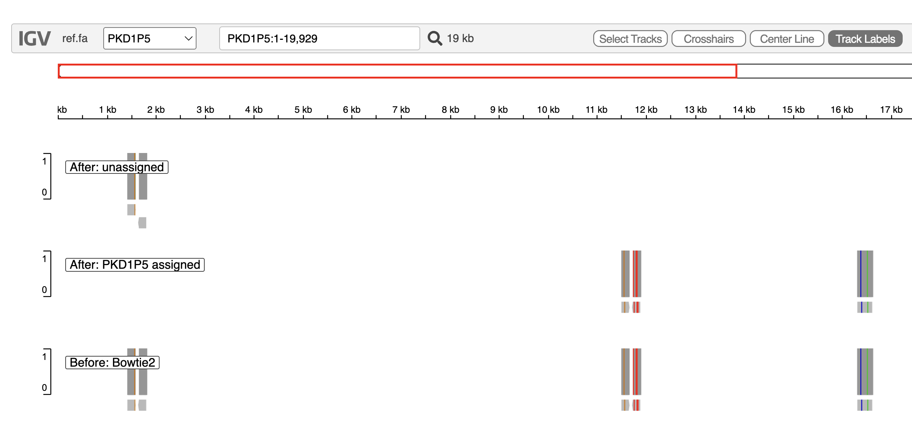

# ParaDISM Demo

This directory contains a self-contained synthetic example that does not use
manuscript or private data:

- `ref.fa`: PKD1 plus six PKD1 pseudogene reference contigs
- `pkd1_sim_R1.fq` and `pkd1_sim_R2.fq`: 20 committed paired-end read pairs
- `run_demo.sh`: runs ParaDISM with Bowtie2 for up to three iterations and
  verifies the expected pair-level assignments
- `summarize_demo.py`: compares the output assignments with the true source
  encoded in each simulated read name
- `generate_demo_reads.sh`: optional script to regenerate the committed reads
  from `ref.fa` with `dwgsim`

From the repository root:

```bash
conda env create -f environment.yml
conda activate paradism
bash demo/run_demo.sh
```

By default, `run_demo.sh` uses the committed reads and writes ParaDISM outputs
to `demo/output/`. Set `OUTPUT_DIR=/path/to/output` before running the script
to choose another ParaDISM output location. The default output directory is
removed and recreated on each run.

Expected output layout:

```text
demo/output/
├── .paradism_complete
├── pkd1_demo_pipeline_<time>.log
├── iteration_1/
│   └── mapped_reads.sam
├── iteration_2/
│   └── variant_calling/
│       └── variants.vcf
└── final_outputs/
    ├── pkd1_demo_fastq/
    │   └── pkd1_demo_<assigned_contig>.fq
    ├── pkd1_demo_bam/
    │   ├── pkd1_demo_<assigned_contig>.sorted.bam
    │   └── pkd1_demo_<assigned_contig>.sorted.bam.bai
    └── pkd1_demo_none/
        └── pkd1_demo_NONE_r1.fq
```

The output root also contains `demo_assignment_summary.tsv`.

The completion marker is created only after all final files have been written.
The pipeline log records stage boundaries and command output. The initial SAM
contains the direct Bowtie2 alignments used for assignment; the final FASTQs
contain assigned reads grouped by reference contig, the final BAMs provide
sorted and indexed alignments for downstream inspection, and the `none`
directory retains unresolved reads rather than discarding them.

The demo permits up to three iterations so that it also exercises ParaDISM's
refinement stopping rule. With this small read set, no variants are found when
iteration 2 begins, so the pipeline reports convergence and stops without
updating the reference. The iteration 2 VCF therefore contains no variant
records. The larger GIAB workflow is the appropriate example for evaluating
refinement when variants are present.

## Expected result

The demo contains 20 read pairs with known source contigs. ParaDISM assigns a
pair only when its sequence evidence supports exactly one contig; ambiguous
pairs are reported as `NONE` rather than forced to a paralog.

| True source | Input pairs | Correct | Unassigned | Incorrect |
| --- | ---: | ---: | ---: | ---: |
| PKD1 | 5 | 5 | 0 | 0 |
| PKD1P1 | 3 | 0 | 3 | 0 |
| PKD1P2 | 2 | 0 | 2 | 0 |
| PKD1P3 | 3 | 0 | 3 | 0 |
| PKD1P4 | 2 | 0 | 2 | 0 |
| PKD1P5 | 3 | 2 | 1 | 0 |
| PKD1P6 | 2 | 2 | 0 | 0 |
| **Total** | **20** | **9** | **11** | **0** |

The expected assignment precision is 100% (9/9 assigned pairs are correct),
and assignment recall is 45% (9/20 input pairs are correctly assigned). The
remaining 11 pairs are retained in the `pkd1_demo_none` outputs. These metrics
describe read assignment in this deterministic example; they are not variant-
calling metrics.

## IGV example

The PKD1P5 view below shows how the final outputs partition the initial Bowtie2
alignments. Bowtie2 placed three read pairs on PKD1P5. ParaDISM assigned the two
pairs with PKD1P5-specific support and retained the ambiguous pair near 1.5 kb
in the `NONE` output rather than assigning it to PKD1P5.



`run_demo.sh` prints this table, writes it to
`demo/output/demo_assignment_summary.tsv`, and exits with an error if any count
differs from the documented result.

To regenerate the small synthetic read set separately, run:

```bash
bash demo/generate_demo_reads.sh
```

To regenerate the reads before running the demo, run:

```bash
REGENERATE_READS=1 bash demo/run_demo.sh
```
